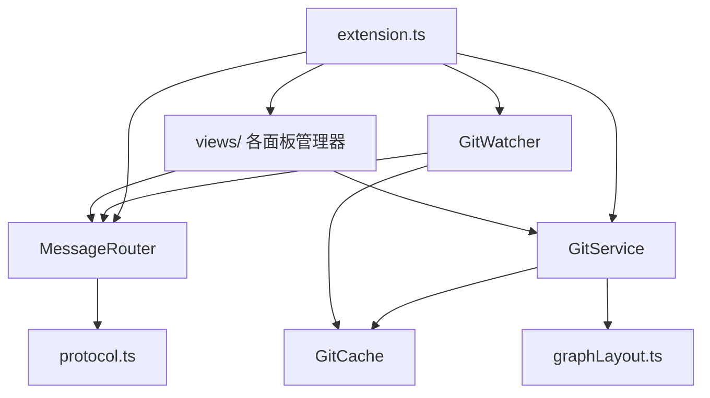
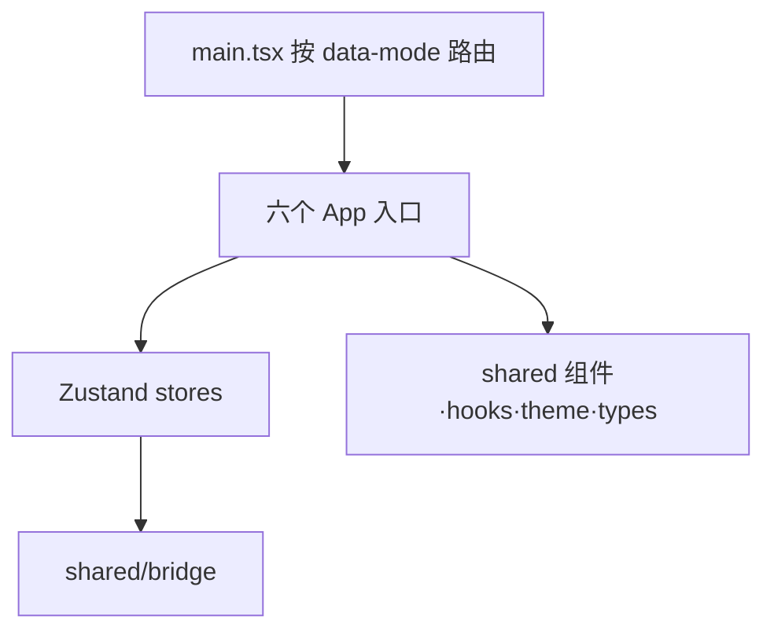
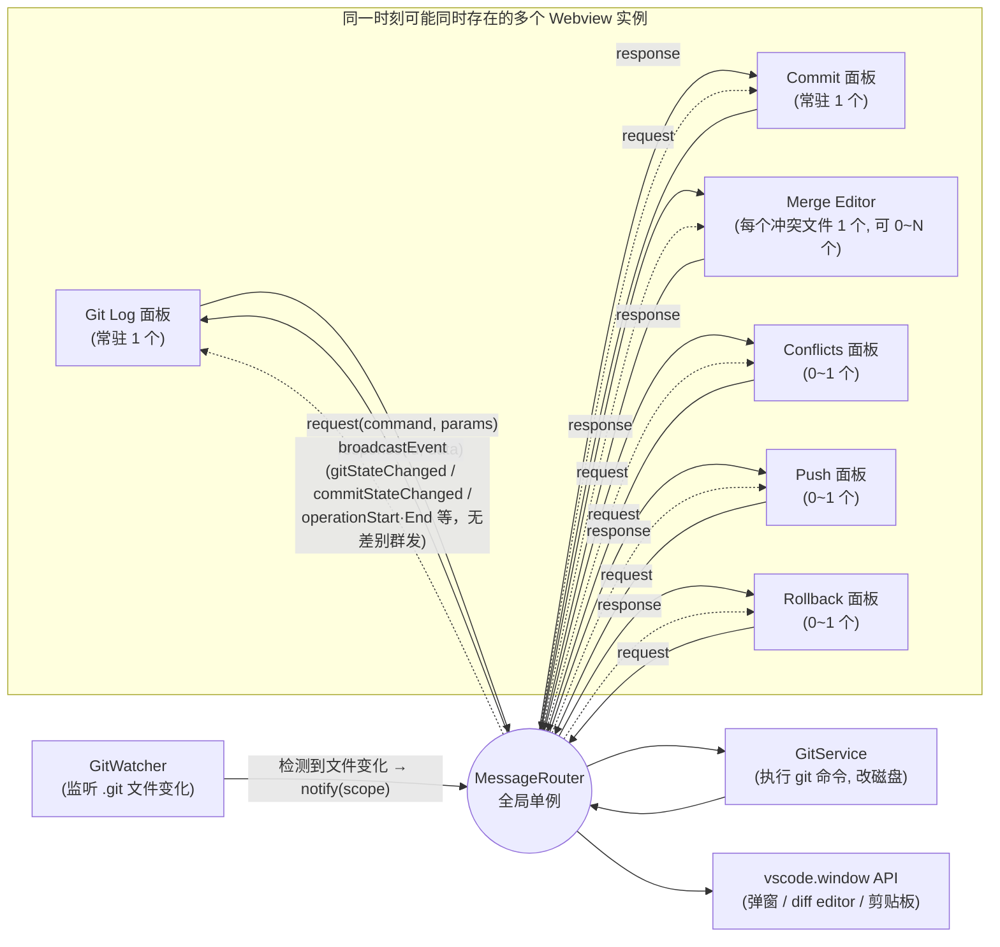

# 架构与设计思路

> 本文记录当前工程的架构分层与关键设计决策的**动机**（而非仅描述代码结构），便于后续维护者理解"为什么这么做"。

## 一、产品定位决定了架构形态

这是一个"把 JetBrains/IDEA 的 Git 体验搬进 VS Code"的插件，不是重新发明一套 Git UI。这个定位直接导致了几个关键设计选择：

- **多个独立面板而不是一个大而全的视图**：Git Log 面板、Commit 面板（含 Shelf/IDEA Shelf）、3-way Merge Editor、Conflicts 列表、Push 对话框、Rollback 面板——对应 IDEA 里真实存在的多个工具窗口，而不是塞进一个 webview。
- **专门实现 IDEA 风格的 Shelf**（区别于标准 `git stash`）：`.idea/shelf/<name>/shelved.patch`，甚至手写了 IDEA patch 格式的解析器（`parseIdeaPatchForFile` / `applyUnifiedDiff`，见 `src/extension.ts`）来还原 base/modified 内容用于 diff。这是为了让从 IDEA 迁移过来的用户行为习惯一致，而不是"能用 stash 顶替就行"——工程量换来的是产品体验上的一致性。

## 二、主机—Webview 分离，但用"单一路由"复用前端产物

- 扩展主机（`src/`）只做数据与副作用：调 Git CLI、监听文件系统、调用 VS Code API（弹窗、diff editor、剪贴板）。
- Webview（`webview/`）是纯 React 前端，**只有一个 Vite 构建产物**（`dist/webview/assets/main.js`），通过 `data-mode` 属性在 `webview/src/main.tsx` 里路由到 `panel | merge | conflicts | commit | push | rollback` 六个 App 之一，`src/views/html.ts` 统一生成骨架 HTML。

这个设计的意图很清楚：**避免为每个 webview 面板单独维护一套构建配置**。所有面板共享 `webview/src/shared/` 下的 bridge、类型、组件、主题，只是入口 App 不同，构建/发布链路简化为一次 `vite build`。

## 三、通信层：类型化的请求/响应 + 广播事件，单一 MessageRouter

`MessageRouter`（`src/messages/messageRouter.ts`）是全局唯一实例，`registerWebview` 让任意一个 webview 接入同一套 handler 表：

- **request/response**：webview 发 `{type:"request", id, command, params}`，主机异步处理后按 `id` 回一个 `response`，天然支持 `Promise` 化（`webview/src/shared/bridge/vscode-bridge.ts` 用 `pendingRequests` Map + 10s 超时）。
- **event 广播**：`gitStateChanged`、`commitStateChanged`、`operationStart/End` 等是主机主动推给所有 webview 的，不需要 webview 轮询。

好处是**新增一个面板不需要新建通信通道**——`MergeEditorManager` / `ConflictsManager` / `PushPanel` 都只是 `messageRouter.registerWebview(panel.webview)` 一行代码接入。代价是 `src/messages/protocol.ts` 里的 `CommandType` 联合类型和 `webview/src/shared/bridge/types.ts` 必须手动保持同步（`CLAUDE.md` 中也专门提到这一点），这是牺牲一点类型安全换来的架构简单性。

## 四、Git 数据层：直接调 CLI，而非 simple-git/isomorphic-git

`src/git/gitService.ts` 用 `execFile` 直接调 `git`，自定义 `\x00` / `\x00\x00\x01` 作为字段/记录分隔符解析 `git log --format=...`。这是一个经过深思的取舍：

- 不引入 `simple-git` 这类封装库的解析开销和不确定行为，命令、参数、输出格式完全自己掌控，方便对齐 IDEA 的展示细节（比如 mailmap 解析的 `%aN` / `%aE`）。
- 所有执行都过 `runGit` 统一记录到一个 Output Channel（带耗时、stderr），这是一个**可观测性优先**的设计——排查用户环境里的 Git 行为差异时非常关键，说明作者预期到了"不同 Git 版本/配置导致的边缘情况"会是长期维护痛点。

## 五、图形布局算法：贪心车道分配 + 快照续接

`src/git/graphLayout.ts` 的 `computeGraphLayout` 是全项目最"硬核"的自研部分：

- **贪心车道分配**：用 `activeLanes` 数组模拟每条"车道"当前等待的 commit hash，遇到已知 hash 复用车道，否则找空位或新增车道，处理 fork/merge/straight 三种连线类型。
- **LaneSnapshot 跨分页稳定性**：这是专门为"虚拟滚动 + 分页加载历史"设计的——`loadMore` 时把上一批的 `activeLanes` / `laneColors` / `nextColorIndex` 传回后端续算，保证滚动加载更多提交时车道颜色和位置不跳变。这体现了对"大仓库、长历史"场景的针对性优化，而不是每次全量重算。
- **渲染选择 SVG+DOM 而非 Canvas**：牺牲一些绘制性能，换取可以直接用 React 组件叠加 tooltip、选中态、hover 高亮，并复用 VS Code 主题 CSS 变量做暗色/亮色适配。

## 六、缓存与实时性的平衡

- `src/git/cache.ts`（`GitCache`）是个极简的 TTL Map（默认 5s），按 key 前缀 `invalidate`。
- `src/watchers/gitWatcher.ts`（`GitWatcher`）监听 `.git/HEAD`、`refs/**`、`index`、`MERGE_HEAD`、`rebase-*` 等具体文件，按语义分成 `all/branches/status/mergeState/log` 五个 scope，**300ms 防抖后才广播 + 清缓存**。

设计意图：Git 命令有一定开销，短时间内的重复请求（比如多个 UI 组件都要拿 branches）应该被缓存挡住；但底层文件一变就要让缓存失效，靠文件系统事件而不是轮询，兼顾实时性和性能。防抖是为了应对 `git checkout`、`git rebase` 这类会连续触发多个文件变更事件的操作，合并成一次广播。

## 七、前端状态管理：每个面板一个 Zustand store，直接订阅 bridge 事件

`webview/src/shared/store/panel-store.ts` 展示了一个模式：**store 自己在模块顶层订阅 `bridge.onEvent`**（文件末尾），收到 `gitStateChanged` 就自触发 `refresh()`。这让组件树完全不需要关心"数据什么时候会变"，只需要从 store 读状态——事件驱动的刷新逻辑被下沉到 store 层而不是分散在组件里。

其他值得注意的细节：
- 服务端过滤（`branch` / `file` 变化需要重新请求 `getGraphData`）与客户端过滤（`searchQuery` / `author` / `dateRange` 只是对已加载 `commits` 数组做 `filterCommits`）被有意分开，减少不必要的 IPC 往返。
- `collapsedIntermediates`（commit 序列折叠）与 selection 状态的联动通过 `deriveSelectionFromVisible` 这类纯函数处理，保证折叠/过滤后选中态不会指向不可见的 commit。

## 八、三方合并编辑器：diff3 + 二次 diff 精细化

`webview/src/conflicts/utils/merge-logic.ts` 里先用 `node-diff3` 的 `diff3MergeRegions` 得到粗粒度的 equal/conflict 块，然后对**每个 conflict 块**再跑一次 `diffArrays`（二方 diff）拆成更细的 sub-block。代码注释明确说明了动机：diff3 在 base 为空（比如 cherry-pick 场景没有真实公共祖先）时会把本该相同的内容一股脑归进一个大冲突块，体验很差。这是典型的"发现现成算法在某个场景下体验不好，针对性地叠加一层后处理"的务实设计，而不是重新造一个 diff 算法。

## 九、危险操作与交互反馈的一致模式

`src/extension.ts` 里所有会丢数据的操作（`deleteBranch`、`rollbackFile`、`deleteShelve`、`dropCommit`、`deleteFiles`）都统一走 `vscode.window.showWarningMessage(..., {modal:true}, "确认文案")` 二次确认；耗时操作（push/merge/rebase/fetch）统一包一层 `withProgress`，靠 `operationStart` / `operationEnd` 事件让前端显示 loading 动画，且 `bridgeWithProgress`（`webview/src/shared/bridge/index.ts`）还强制了最少 1 秒的展示时长，避免"闪一下就消失"的体验问题——这些都是从 IDEA 交互习惯里抄过来的细节，说明设计上很在意"手感"而不只是功能对齐。

## 十、GUI 与 Git/文件系统的解耦：不持有状态，只持有"上一次的快照"

这套架构要解决的一个核心问题是：**用户完全可能在终端里直接敲 git 命令，GUI 必须能自动感知并纠正自己**，而不是维护一份可能与磁盘漂移的本地模型。设计上把这句话拆成四层机制：

### 1. 真正的"缓存"只在后端，而且短命、被动失效

- webview 侧 Zustand store 里的 `commits` / `branches` / `workingTreeChanges` 等，严格说不是"缓存"，而是"上一次从磁盘读到的快照，专门给 React 渲染用"——没有 TTL、没有过期策略、不持久化（不写 localStorage/IndexedDB）。webview 被销毁重建就是空白重新拉一次，不存在"恢复缓存"这个概念。
- 唯一带 TTL 的缓存是后端 `GitCache`（`src/git/cache.ts`，5s），作用不是给 GUI 做长期状态存储，而是防止**同一次交互里多个组件短时间内重复调用同一个 git 命令**（比如面板刷新时 branches/tags/graph 几乎同时被好几处请求）。它存活的时间比一次用户交互还短。

### 2. 感知变化靠操作系统文件事件，不是轮询、不是 GUI 自己猜

`GitWatcher`（`src/watchers/gitWatcher.ts`）用 `vscode.workspace.createFileSystemWatcher` 直接订阅 `.git` 内部关键文件（`HEAD`、`refs/heads/**`、`refs/remotes/**`、`refs/tags/**`、`index`、`MERGE_HEAD`、`CHERRY_PICK_HEAD`、`rebase-merge/**`、`rebase-apply/**`、`COMMIT_EDITMSG`）。这是 OS 级别的 inotify/FSEvents 通知，不是定时跑 `git status` 比对。检测到变化后：

```
文件变了 → 300ms 防抖 → cache.invalidate()（清空后端缓存） → broadcastEvent("gitStateChanged")
```

终端敲的 git 命令和面板点按钮触发的 `gitService.xxx()`，改的是完全相同的文件，所以对 `GitWatcher` 来说这两者**没有区别**——不需要知道"这次改动是谁发起的"。

### 3. 收到"变了"的信号后，永远是整体重拉，不做增量合并

`panel-store.ts` / `commit-store.ts`（`webview/src/shared/store/commit-store.ts:481-486`）收到 `gitStateChanged` / `commitStateChanged` 后，统一整体重新请求（`getGraphData` / `getBranches` / `getWorkingTreeChanges` / `getShelves`...），**没有任何"把 diff 打到现有 state 上"的逻辑**。宁可多一次进程内 IPC 往返，也不写增量同步代码——增量同步一旦有一处逻辑漏了，就会产生"GUI 显示的和磁盘真实状态不一致"且不会自愈的 bug；全量重拉的好处是**每次都自愈**，不管之前的状态多离谱，下一次事件一来就被真实数据覆盖。

### 4. 中间态、操作结果都不是 GUI"自己记的"，是每次现查

- `isMerging` / `isRebasing` / `isCherryPicking` 不是"点了按钮就 setState 一个标志"，而是每次都实际读 `.git/MERGE_HEAD`、`.git/rebase-merge/` 等文件是否存在——不管这个中间态是 GUI 点出来的还是终端敲出来的，查到的都是同一份真相。
- 没有乐观更新（optimistic UI）：点"删除分支"不会立刻从列表划掉，而是 `operationStart` → 真正执行 git 命令 → 文件系统真的变了 → watcher 触发 → 拿到真实结果后才刷新列表（`withProgress`，见 `src/extension.ts`）。用 loading 动画盖住这段等待，换来的是列表任何时候展示的都是磁盘上真实存在的东西。

### 这套机制的边界：只能覆盖"被监听路径"内的变化

这套"文件监听 → 失效 → 整体重拉"模式的前提是**变化必须落在被监听的文件路径上**。已知的缝隙及处理情况：

- ~~`git stash drop` / `stash clear` 只改 `.git/refs/stash`，不碰 `index`，不会触发刷新~~ —— **已修复**：`GitWatcher.setupFileWatchers()` 现在额外监听 `.git/refs/stash` 与 `.git/logs/refs/stash`，两个操作都会走既有的"整体重拉"链路。
- `git gc` / `git pack-refs` 把引用打包进 `.git/packed-refs`（未被监听）而不写 `refs/heads/xxx`，不会触发刷新。**暂不处理**：触发条件苛刻（非日常操作），且监听它会导致 git 后台自动 gc 时产生不必要的全量刷新噪音，性价比低，先记录为已知限制。
- ~~终端和面板可能同时抢 `.git/index.lock`，冲突时直接把 git 原始报错抛给用户~~ —— **已改善**：`gitService.runGit()` 现在识别 `index.lock` 相关的报错并转换成更友好的提示（"另一个 Git 进程正在运行，请稍后重试"），而不是把英文原始报错直接丢给用户。注意这只是**错误文案层面的改善**，没有引入重试/排队逻辑——并发写入冲突本身仍然完全依赖 git 自身的锁机制兜底。

## 十一、整体数据流：读写分离的两条链路

把前面几节串起来看，全局数据流可以拆成"读"和"写"两条方向，且**写操作本身不负责更新 UI**。

### 读路径（磁盘 → 界面）

```
.git/ 目录 + 工作区文件
      │  (git 命令)
      ▼
GitService.execGit()          ← execFile 直调 git CLI，解析 \x00 分隔的输出
      │
      ▼
GitCache（5s TTL，被动失效）    ← 短时间内的重复读请求在这里被拦下
      │
      ▼
messageRouter.handle(command)  ← src/extension.ts 里注册的一堆 handler
      │  (response: {type:"response", id, success, data})
      ▼
vscode-bridge.ts (webview)     ← 按 id 匹配 pendingRequests，resolve Promise
      │
      ▼
Zustand store (panel-store / commit-store / merge-store)
      │  (set({...}) 触发订阅)
      ▼
React 组件重渲染
```

### 写路径（界面 → 磁盘）

```
用户点击（比如"删除分支"）
      │
      ▼
store action → bridge.request / bridgeWithProgress
      │  (request: {type:"request", id, command:"deleteBranch", params})
      ▼
messageRouter.handleRequest() → 找到对应 handler
      │
      ▼
GitService.deleteBranch() → execFile git branch -d ...
      │
      ▼
.git/refs/heads/xxx 被真正删除（磁盘状态改变）
```

### 关键：写完之后不是把结果直接塞回 store，而是重新走一遍读路径

写操作 handler 做完事情后，只广播一句"变了"：

```
messageRouter.broadcastEvent("gitStateChanged", {scope:"all"})
```

真正让 UI 更新的是另一条独立触发的链路——可能来自上面这个主动广播，也可能来自 `GitWatcher` 监听到的文件变化（参见第十节），两者殊途同归：

```
GitWatcher（监听 .git 内部文件）── 或 ── handler 主动 broadcastEvent
      │
      ▼
webview 里的 bridge.onEvent(("gitStateChanged") => store.refresh())
      │
      ▼
store 重新完整发起一轮"读路径"的请求（getGraphData/getBranches/getWorkingTreeChanges...）
      │
      ▼
React 组件重渲染
```

也就是说，**写路径和"UI 怎么更新"是解耦的两条链**：写操作只负责改磁盘 + 吼一声"变了"，至于 UI 怎么变，永远统一走读路径重新拉一遍全量数据——不存在把 mutation 的返回值直接 patch 进 store 的写法（没有乐观更新，也没有把 handler 返回结果当作新状态塞回去）。这正是为什么面板按钮触发的写和终端手动敲命令触发的写，最终收敛到的是同一条更新路径。

## 十二、模块拓扑图（静态依赖关系）

这张图展示的是"谁 import 谁"的静态依赖，分别对应 `src/`（扩展主机）和 `webview/src/`（前端），两边之间**没有任何直接 import**——唯一的连接点是运行时的 postMessage 通道（`MessageRouter` ↔ `bridge`），这也是 CLAUDE.md 里强调"两边协议要手动保持同步"的根本原因：编译器没法帮你检查跨这条边界的类型一致性。

**扩展主机 `src/`**



**Webview 前端 `webview/src/`**



两图之间的连接（图里画不出来，靠 postMessage 而非 import）：

```
webview 的 BRIDGE  <-- postMessage，无编译期类型检查 -->  主机的 ROUTER
```

**每个分组节点包含的具体文件**：

| 分组节点 | 具体文件 |
|---|---|
| `VIEWS`（views/ 各面板管理器） | `gitLogViewProvider.ts`（常驻侧边栏）、`commitViewProvider.ts`（常驻侧边栏）、`mergeEditorManager.ts`（按需创建，可多实例）、`conflictsManager.ts`、`diffEditorManager.ts`、`pushPanel.ts`、`rollbackPanel.ts`、`gitContentProvider.ts`、`html.ts`（统一生成 webview 骨架 HTML，被前 6 者共用） |
| `APPS`（六个 App 入口） | `panel/App.tsx`、`commit/App.tsx`、`conflicts/App.tsx`、`conflicts/MergeStandaloneApp.tsx`、`push/App.tsx`、`rollback/App.tsx` |
| `STORES`（Zustand stores） | `shared/store/panel-store.ts`（→ panel）、`shared/store/commit-store.ts`（→ commit）、`shared/store/merge-store.ts`（→ conflicts / merge） |
| `SHARED`（shared 组件·hooks·theme·types） | `shared/components`、`shared/hooks`、`shared/theme`、`shared/types` |

## 十三、通信拓扑图（运行时消息流）

和上面的静态依赖图不同，这张图反映的是**运行时**：`MessageRouter` 是唯一的通信枢纽，同一时刻可能有多个 webview 实例（Git Log、Commit 是常驻的；Merge Editor 每打开一个冲突文件就是一个新实例；Conflicts/Push/Rollback 按需创建）**同时**注册在它上面，构成一个星型拓扑。

图中实线和虚线代表两种不同性质的通信：

- **实线（`-->`）= 点对点、一问一答**：`request`/`response`（webview 主动发起，带 `id`，只回给发起方一个）；以及 `GitWatcher -->|notify(scope)| MessageRouter`、`MessageRouter --> GitService/vscode.window API` 这类主机内部的直接函数调用/单次触发，语义上都是"一次调用对应一次确定的目标或结果"。
- **虚线（`-.->`）= 广播、一对多、无回执**：`broadcastEvent`（`gitStateChanged` / `commitStateChanged` / `operationStart·End` 等），`MessageRouter` 不管当前注册了几个 webview、也不管它们要不要这条消息，直接群发一遍；接收方是否处理、要不要重新拉数据，完全由各自的 store 自己决定（见第七、十节）。

一句话区分：**实线是"谁问的谁听结果"，虚线是"广播喇叭，听不听你自己看着办"。**



这张图能直接解释前面几节的两个关键行为：
- **为什么新增一个面板不用碰通信协议**：新面板只是在这个星型拓扑里多接一条边（`messageRouter.registerWebview(panel.webview)`），`MessageRouter` 本身的逻辑完全不用改。
- **为什么一次分支删除，Git Log、Commit、Push 面板会同时刷新**：`broadcastEvent` 是无差别群发，不区分"这个事件跟你有没有关系"，每个 store 收到后自己决定要不要重新拉数据（第七、十节）。

## 十四、已知限制与后续改进方向

### `updateBranch` 对 Git < 2.27 支持不完整（`--autostash` 版本兼容）

**现状**：`src/git/gitService.ts:850-878`（`updateBranch`）里 `merge --autostash`、`merge --ff-only --autostash` 直接使用 `--autostash`。这个 flag 用在 `git merge`（含走 merge 策略的 pull）是 **Git 2.27**（2020-06）才加入的；`git rebase --autostash` 则从 **Git 2.6**（2015）就支持。代码里没有版本探测，也没有针对老版本的降级路径——机器上的 Git 低于 2.27 时，走 merge 的分支会直接抛出 `unknown option '--autostash'`，且报错是原始英文，没有像第十节里 `index.lock` 那样做过友好化。

**参考实现**：VS Code 内置 Git 插件用 `compareGitVersionTo('2.27.0')` 判断，≥2.27 走原生 `--autostash`（`extensions/git/src/git.ts:2462-2464`），<2.27 则用 `maybeAutoStash()` 包一层"手动 stash → 执行 → `finally` 里无条件 pop"（`extensions/git/src/repository.ts:3159-3175`）。它把 pop 放进 `finally`，不区分操作是成功还是冲突失败，靠的是 `git stash pop` 在 apply 失败时不会丢弃 stash 条目这个安全特性兜底——冲突就冲突，stash 记录还在，顶多让用户多处理一层，不会丢改动。

**计划的改进方向**（比 VS Code 的简化做法更"干净"，暂不实现，先记录）：不满足于"`finally` 里无脑 pop"，而是把 stash 的生命周期和 merge/rebase"是否进入冲突态"显式绑定，手动控制完整的四个阶段：

1. **发起阶段**（`updateBranch`）：探测到老版本 Git 时，先手动 `git stash`（含 untracked），再执行不带 `--autostash` 的 `merge`/`rebase`。
2. **成功路径**：merge/rebase 直接成功 → 立即 pop 回来，行为等价于原生 `--autostash`。
3. **失败进入冲突态**：这一步**不 pop**——工作区此时已经处于冲突态，贸然 pop 等于在一个冲突基础上再叠一层 stash 冲突。把"存在一个待归还的 stash"这件事记下来即可（可以靠一个约定的 stash message 识别，而不需要额外持久化状态，呼应第十节"不持有状态、每次现查"的原则）。
4. **收尾阶段**（`rebaseAction("continue"/"abort")`、`mergeContinue()`、`mergeAbort()`）：这几个方法执行完、工作区回到无冲突状态之后，检查是否存在第 3 步留下的那个约定 stash，如果有，这时候才 pop 回来。

这样任何一次 pop 都发生在"工作区已确认无冲突"之后，不依赖 `git stash pop` 失败不丢数据这个安全网兜底，而是从源头上避免制造"冲突叠冲突"的中间态；代价是要跨 `updateBranch` / `rebaseAction` / `mergeContinue` / `mergeAbort` 四个方法协调状态，比 VS Code 的一层 `try/finally` 包装工作量更大。

---

## 总结

整个架构的核心矛盾是"如何在 VS Code 的 webview + extension 双进程模型里，尽量廉价地支撑多个独立又要保持一致体验的 IDEA 风格面板"，解法是：

- 单一 `MessageRouter` 做通信总线
- 单一构建产物靠 `mode` 路由到不同 React App
- Git 数据自己解析、不依赖重型库
- 图形布局自研并做增量续接（`LaneSnapshot`）
- 状态管理下沉到 Zustand store 自订阅事件
- GUI 不持有持久状态，只靠"文件监听 → 失效 → 整体重拉"跟磁盘上的真实 Git 状态对齐

这是一套偏"手工优化、贴近底层"的实现风格，而非套用现成框架方案。
